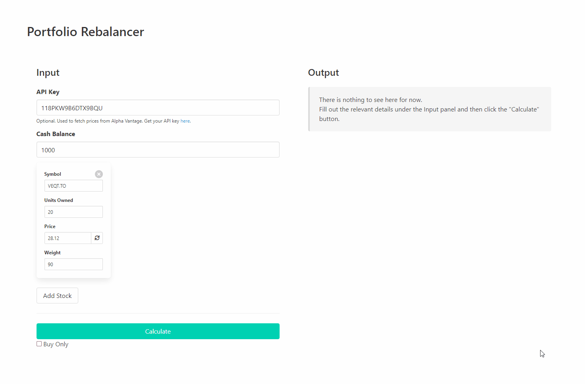

# Portfolio Rebalancer

A simple Svelte web application tool that calculates the amount of stocks to buy and sell in order to achieve the desired asset allocation in an investment portfolio. 

## Demo
Try it yourself @ https://demo-portfoliorebalancer.alisterpineda.com

### How To Run Locally

1. Clone the repo
2. Assuming Node.js is installed, run `npm install` in the shell of your choice in the repo directory.
3. Run `npm run dev`

## How To Use

### Top-Level Controls

**Cash Balance** : The amount of cash available in the investment account.

**Buy Only**: If checked, the app will, as much as it can, rebalance the account without selling. This is useful when there are costs to selling shares.

### Stock Position Controls

**Symbol**: The abbreviated unique identifier of the stock. This value is used when fetching a quote from Alpha Vantage.

**Units Owned**: The number of shares owned.

**Price**: The price of a single share of the stock.

**Weight**: This value determines the target allocation for the stock in the investment account. The allocation for the stock would be its weight divided by the total weight of the investment account. *For example, stock A with a weight of 20 and stock B with a weight of 30 will have target allocations of 20/50=40% and 30/50=60% respectively.*

## How It Works

The cash balance and stock positions provided to the app are considered collectively as the *Account*.

The *Account* has a hidden variable called the *Score* which is the square root of the sum of *Subscores* which are derived from the cash balance and each of the individual stock positions.

A *Subscore* of an asset like the cash balance or a stock position is calculated by the following equation:

where 

With the given equations so far, it should be clear that the *Score* is the [Euclidean distance](https://en.wikipedia.org/wiki/Euclidean_distance) between the two points, the current *Account* and the target *Account*, where the number of dimensions depend on the number of stock positions.

The app essentially tries to minimize the distance/*Score* as much as possible by tweaking the quantity held by each stock position with the available cash balance in mind. The difference between the original quantity and the final quantity after the calculation determines the amount the user should buy or sell on a particular stock.